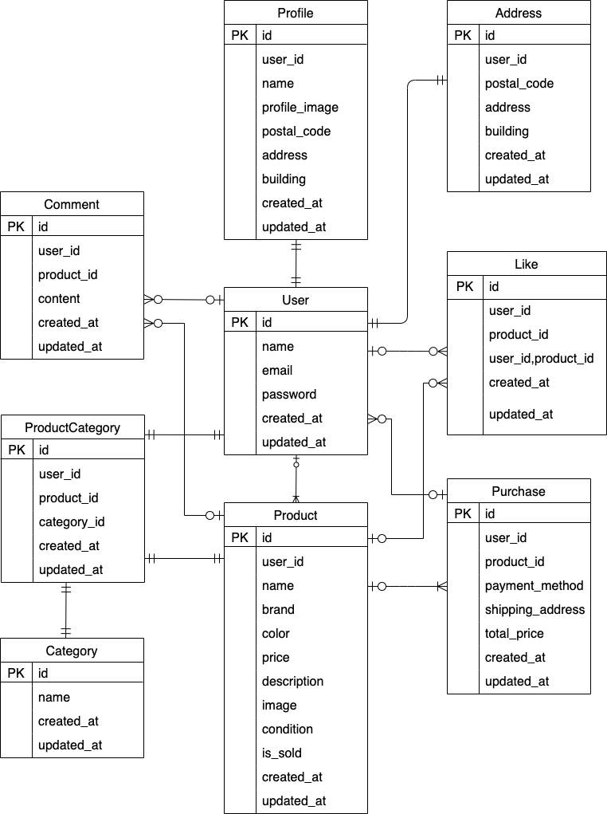

# coachtech-flea-market

## 環境構築

### Docker ビルド

1. git clone git@github.com:coachtech-material/laravel-docker-template.git
1. docker-compose up -d --build

### Laravel 環境構築

1. docker-compose exec php bash
2. composer install
3. composer require livewire/livewire
4. cp .env.example .env
5. .env ファイルの一部を以下のように編集

```
DB_HOST=mysql
DB_DATABASE=laravel_db
DB_USERNAME=laravel_user
DB_PASSWORD=laravel_pass
```

6. php artisan key:generate
7. php artisan migrate
8. php artisan db:seed

## 使用技術

- MySQL 8.0.26
- PHP 7.4.9-fpm
- Laravel 8

## URL

- 環境開発: http://localhost/login
- phpMyAdmin: http://localhost:8080/

## ER 図


